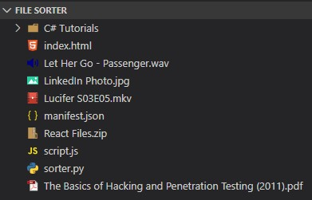
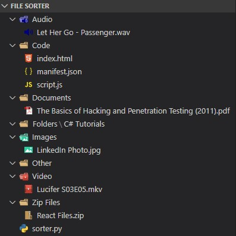

# Python Folder Sorter

The purpose of this script is to automatically sort a directory using one Python 3 script. The default folders are Documents, Video, Audio, Images, Zip Files, Code, Folders, and Other. These can be changed later in the Python script. No external libraries are needed as it utilizes the shutil and os libraries only. 

## Getting Started

These instructions will get you a copy of the project up and running on your local machine for development and testing purposes. 

### Prerequisites

Python 3 Installed on Windows, Mac, or Linux.

### Changing Folders and Extensions

The extensions and their corresponding folders can be changed inside the extensions dictionary at the beginning of the script.

## Running the script

For Windows:
```
python sorter.py
```
For Mac and Linux:
```
python3 sorter.py
```
## Example


### Before:
 
### After:



## Authors

* **Sharif Kanaan** - [GitHub](https://github.com/Sharizzle) | | [Website](https://sharif.thekanaan.com/) | | [Email](mailto:sharif@thekanaan.com) || [Linkedin](https://www.linkedin.com/in/SharifKanaan/)

## License

This project is licensed under the MIT License - see the [LICENSE](LICENSE) file for details
